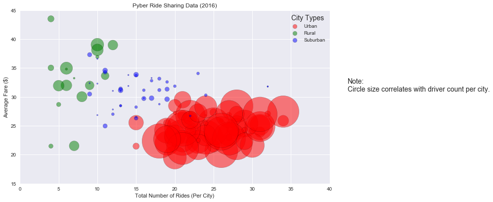
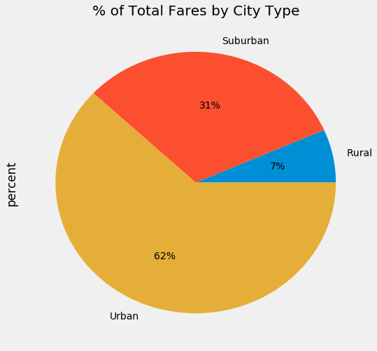
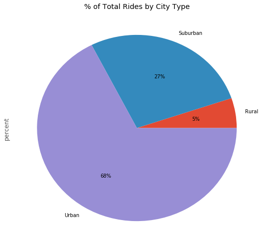
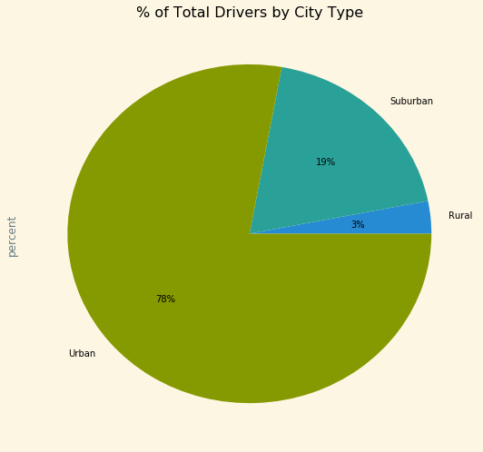

## Pyber Ride Sharing

#### Observed Trend 1:  The most revenue is clearly generated in Urban areas
#### Observed Trend 2:  The revenue amount collected in Urban is influenced by the number of rides in the urban areas, however it may also be influenced by the much larger amount of drivers in the urban areas.  More drivers pick up more riders.
#### Observed Trend 3:  It may be a benefit to the company to start using more drivers in the Suburban areas.  According to the bubble plot there are several Suburban cities with a large number of rides, but a comparatively small number of drivers when compared to the Urban cities.


```python
import pandas as pd
import os
import matplotlib.pyplot as plt
import matplotlib.cm as cm
from matplotlib.offsetbox import AnchoredText as at
```


```python
df1 = pd.read_csv("city_data.csv")
df2 = pd.read_csv("ride_data.csv")
```


```python
df = pd.merge(df1,df2, on='city', how='outer')
df.head()
```


<div>
<style>
    .dataframe thead tr:only-child th {
        text-align: right;
    }

    .dataframe thead th {
        text-align: left;
    }

    .dataframe tbody tr th {
        vertical-align: top;
    }
</style>
<table border="1" class="dataframe">
  <thead>
    <tr style="text-align: right;">
      <th></th>
      <th>city</th>
      <th>driver_count</th>
      <th>type</th>
      <th>date</th>
      <th>fare</th>
      <th>ride_id</th>
    </tr>
  </thead>
  <tbody>
    <tr>
      <th>0</th>
      <td>Kelseyland</td>
      <td>63</td>
      <td>Urban</td>
      <td>2016-08-19 04:27:52</td>
      <td>5.51</td>
      <td>6246006544795</td>
    </tr>
    <tr>
      <th>1</th>
      <td>Kelseyland</td>
      <td>63</td>
      <td>Urban</td>
      <td>2016-04-17 06:59:50</td>
      <td>5.54</td>
      <td>7466473222333</td>
    </tr>
    <tr>
      <th>2</th>
      <td>Kelseyland</td>
      <td>63</td>
      <td>Urban</td>
      <td>2016-05-04 15:06:07</td>
      <td>30.54</td>
      <td>2140501382736</td>
    </tr>
    <tr>
      <th>3</th>
      <td>Kelseyland</td>
      <td>63</td>
      <td>Urban</td>
      <td>2016-01-25 20:44:56</td>
      <td>12.08</td>
      <td>1896987891309</td>
    </tr>
    <tr>
      <th>4</th>
      <td>Kelseyland</td>
      <td>63</td>
      <td>Urban</td>
      <td>2016-08-09 18:19:47</td>
      <td>17.91</td>
      <td>8784212854829</td>
    </tr>
  </tbody>
</table>
</div>


```python
labels = ["city","fare","type","driver_count"]
rides = df.loc[:,labels]
rides.head()

```


<div>
<style>
    .dataframe thead tr:only-child th {
        text-align: right;
    }

    .dataframe thead th {
        text-align: left;
    }

    .dataframe tbody tr th {
        vertical-align: top;
    }
</style>
<table border="1" class="dataframe">
  <thead>
    <tr style="text-align: right;">
      <th></th>
      <th>city</th>
      <th>fare</th>
      <th>type</th>
      <th>driver_count</th>
    </tr>
  </thead>
  <tbody>
    <tr>
      <th>0</th>
      <td>Kelseyland</td>
      <td>5.51</td>
      <td>Urban</td>
      <td>63</td>
    </tr>
    <tr>
      <th>1</th>
      <td>Kelseyland</td>
      <td>5.54</td>
      <td>Urban</td>
      <td>63</td>
    </tr>
    <tr>
      <th>2</th>
      <td>Kelseyland</td>
      <td>30.54</td>
      <td>Urban</td>
      <td>63</td>
    </tr>
    <tr>
      <th>3</th>
      <td>Kelseyland</td>
      <td>12.08</td>
      <td>Urban</td>
      <td>63</td>
    </tr>
    <tr>
      <th>4</th>
      <td>Kelseyland</td>
      <td>17.91</td>
      <td>Urban</td>
      <td>63</td>
    </tr>
  </tbody>
</table>
</div>


```python
cityCount =  pd.DataFrame(rides.groupby(['city','type','driver_count'])['city'].agg('count'))
cityAvg = pd.DataFrame(rides.groupby('city')['fare'].agg('mean'))
cityCount = cityCount.rename(columns={'city': 'RideCount'})
cityCount = cityCount.reset_index()
cityAvg = cityAvg.reset_index()
cityCount.columns.values[0] = 'city'
cityCount.columns.values[1] = 'type'
All = pd.merge(cityCount,cityAvg, on='city', how='inner')
All.head()
```


<div>
<style>
    .dataframe thead tr:only-child th {
        text-align: right;
    }

    .dataframe thead th {
        text-align: left;
    }

    .dataframe tbody tr th {
        vertical-align: top;
    }
</style>
<table border="1" class="dataframe">
  <thead>
    <tr style="text-align: right;">
      <th></th>
      <th>city</th>
      <th>type</th>
      <th>driver_count</th>
      <th>RideCount</th>
      <th>fare</th>
    </tr>
  </thead>
  <tbody>
    <tr>
      <th>0</th>
      <td>Alvarezhaven</td>
      <td>Urban</td>
      <td>21</td>
      <td>31</td>
      <td>23.928710</td>
    </tr>
    <tr>
      <th>1</th>
      <td>Alyssaberg</td>
      <td>Urban</td>
      <td>67</td>
      <td>26</td>
      <td>20.609615</td>
    </tr>
    <tr>
      <th>2</th>
      <td>Anitamouth</td>
      <td>Suburban</td>
      <td>16</td>
      <td>9</td>
      <td>37.315556</td>
    </tr>
    <tr>
      <th>3</th>
      <td>Antoniomouth</td>
      <td>Urban</td>
      <td>21</td>
      <td>22</td>
      <td>23.625000</td>
    </tr>
    <tr>
      <th>4</th>
      <td>Aprilchester</td>
      <td>Urban</td>
      <td>49</td>
      <td>19</td>
      <td>21.981579</td>
    </tr>
  </tbody>
</table>
</div>


### Bubble Plot of Ride Sharing Data


```python
urban1 = All[All['type'] == 'Urban']
suburban1 = All[All['type'] == 'Suburban']
rural1 = All[All['type'] == 'Rural']
```


```python
plt.style.use('seaborn')
plt.figure(figsize=(10,6))

urban = plt.scatter(urban1['RideCount'],urban1['fare'], marker="o", color='red', edgecolors="black",
            s=urban1['driver_count']**2, alpha=0.5)

rural = plt.scatter(rural1['RideCount'],rural1['fare'], marker="o", color='green', edgecolors="black",
            s=suburban1['driver_count']**2, alpha=0.5)

suburban = plt.scatter(suburban1['RideCount'],suburban1['fare'], marker="o", color='blue', edgecolors="black",
            s=rural1['driver_count']**2, alpha=0.5)
plt.title('Pyber Ride Sharing Data (2016)')
plt.xlabel('Total Number of Rides (Per City)')
plt.ylabel('Average Fare ($)')
plt.xlim(0,40)
plt.ylim(15, 45)
# Create a legend
lgnd = plt.legend([urban, rural, suburban], ['Urban', 'Rural', 'Suburban'], loc='best',title='City Types')
for handle in lgnd.legendHandles:
    handle.set_sizes([75.0])
#plt.grid()

plt.figtext(1,.5,'Note:\nCircle size correlates with driver count per city.')
# Show the chart
plt.show()
```





### Total Fares by City Type


```python
plt.style.use('fivethirtyeight')
All['fareAmounts'] = All['RideCount'] * All['fare']
All.head()
fareGroup = pd.DataFrame(All.groupby('type')['fareAmounts'].sum())
fareGroup['total'] = sum(fareGroup['fareAmounts'])
fareGroup['percent'] = fareGroup['fareAmounts'] / fareGroup['total']
fareGroup
pie_chart = fareGroup['percent'].plot(kind='pie', figsize=(8,8), autopct='%1.f%%')
plt.title('% of Total Fares by City Type')
plt.show()
```





### Total Rides by City Type


```python
plt.style.use('ggplot')
rideGroup = pd.DataFrame(All.groupby('type')['RideCount'].sum())
rideGroup['total'] = sum(rideGroup['RideCount'])
rideGroup['percent'] = rideGroup['RideCount'] / rideGroup['total']
rideGroup
pie_chart = rideGroup['percent'].plot(kind='pie', figsize=(8,8), autopct='%1.f%%')
plt.title('% of Total Rides by City Type')
plt.show()
```





### Total Drivers by City Type


```python
plt.style.use('Solarize_Light2')
driverGroup = pd.DataFrame(All.groupby('type')['driver_count'].sum())
driverGroup['total'] = sum(driverGroup['driver_count'])
driverGroup['percent'] = driverGroup['driver_count'] / driverGroup['total']
driverGroup
pie_chart = driverGroup['percent'].plot(kind='pie', figsize=(8,8), autopct='%1.f%%')
plt.title('% of Total Drivers by City Type')
plt.show()
```




